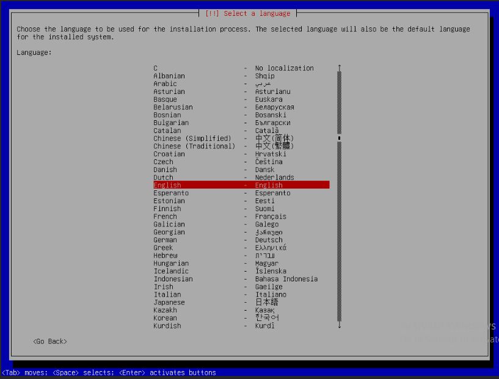
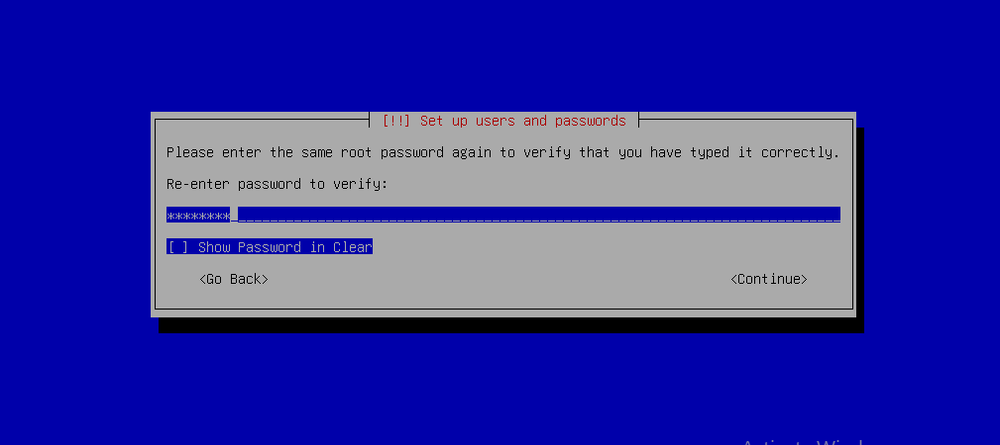
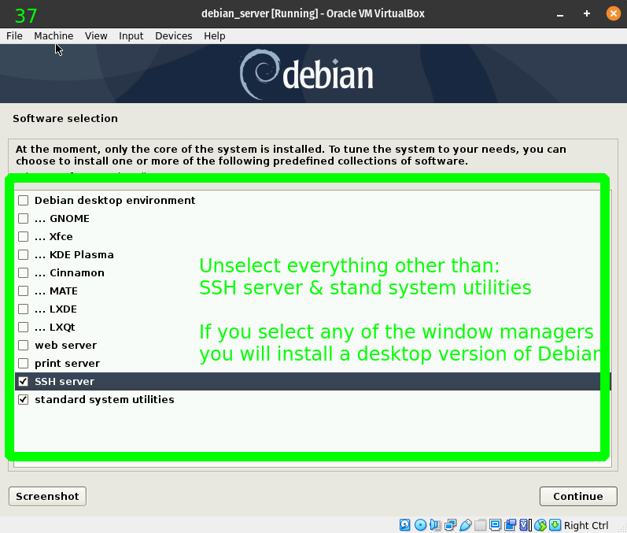

# Hướng dẫn đóng image Debian 12 với cloud-init và QEMU Guest Agent (không dùng LVM)

## Chú ý:

- Hướng dẫn này dành cho các image không sử dụng LVM
- Sử dụng công cụ virt-manager hoặc web-virt để kết nối tới console máy ảo
- OS cài đặt KVM là Debian 12
- Phiên bản OpenStack sử dụng là Queens
- Hướng dẫn bao gồm 2 phần chính: thực hiện trên máy ảo cài OS và thực hiện trên KVM Host

___

### Tạo máy ảo bằng KVM

>Sử dụng MobaXterm hãy thêm tuỳ chọn -X khi ssh vào máy chủ KVM để thực hiện

- Khai báo tài nguyên ổ cứng cho máy ảo

```sh
qemu-img create -f qcow2 /var/lib/libvirt/images/Debian-20072023.qcow2  10G
```

- Tạo máy ảo, có thể sử dụng virt-manager để có đồ hoạ

```sh
virt-install --connect qemu:///system \
--name UBUNTU-22.04-13072023 --ram 1024 --vcpus 1 \
--network network=default,model=virtio \
--disk path=/var/lib/libvirt/images/Debian-20072023.qcow2,format=qcow2,device=disk,bus=virtio \
--cdrom /var/lib/libvirt/images/iso/debian-12.1.0-amd64-netinst.iso \
--vnc --os-type linux --os-variant ubuntu22.04
```

Sau khi chạy câu lệnh trên sẽ nhận được một khung cài đặt vm với GUI, nếu không nhận được thì có thể là bị treo. Xử lý theo cách sau:

```sh
ps aux | grep virt
```

Thu được các ID các tiến trình của virt, kill tất cả chúng theo ID

```sh
kill x x x
```

Khởi chạy lại:

```sh
service libvirtd restart
virsh list --all
virsh start UBUNTU-22.04-13072023
virt-manager
```

- Thu được giao diện tương tự như sau

Sử dụng bàn phím để di chuyển giữa các lựa chọn, Phím enter để đồng ý lựa chọn. DI chuyển xuống, Chọn install


Có thể để mặc định hoặc di chuyển xuống other để tìm và chọn Aisa/VietNam



Mã hoá mặc định


Bàn phím mặc định


Chờ một lúc để hệ thống tự đọc dữ liệu từ fire iso. Điền vào host name


Domain name có thể điền hoặc bỏ trống


Root password, nếu bỏ trống thì sẽ được tạo ra 1 user khác với quyền sudo, nếu không muốn làm thế thì hãy nhập password cho tài khoản root.


Ở đây sẽ lựa chọn tạo password cho root, Nhập lần 2 để xác nhận mật khẩu



Điền thông tin cho tài khoản ban đầu đăng nhập lúc khởi động hệ thống


Password cho tài khoản ban đầu:


Xác nhận password:


Để hệ thống ghi nhận. Rồi sẽ tiếp tục cấu hình ổ cứng. vì không sử dụng LVM và swap nên ta sẽ chọn Manual:


Lựa chọn ổ cứng sẽ dùng để cài đặt:


Chọn yes:


Lựa chọn toàn bộ phân vùng đang có:


Chọn tạo mới phân vùng


Kích thước cho phân vùng mới, mặc định là toàn bộ dung lượng hiện có:


Chọn primary


Nên để mặc định, di chuyển xuống chọn done...:


Đã được cấu hình, di chuyển xuống chọn Finish....


Xác nhận, chọn no để không tạo phân vùng swap:


Xác nhận tạo phân vùng


Hệ thống sẽ chạy để tạo phân vùng mới. Tạo và cài đặt các thức cần thiết hoàn tất sẽ nhận được thông báo sau để scan các thiết bị media, có thể chọn yes nếu muốn.


Nếu KVM của bạn có kết nối ra internet thì sẽ được tự phát hiện vùng Vietnam, nếu không sẽ phải tự điền thông tin khá rắc rối.


Lựa chọn tuỳ ý:


Để trống, nếu có proxy và muốn sử dụng thì hãy điền:


Hệ thống sẽ tự tiến hành config, cần 1 thời gian ngắn. Thông báo thu thập thông tin hoạt động của hệ thống, có thể cung cấp hoặc không.


Bỏ chọn 2 lựa chọn đầu, nếu muốn sử dụng GUI thì có thể lựa chọn. Chọn và bỏ chọn với phím cách. Di chuyển xuống chọn SSH Server. Chờ cài đặt hoàn tất



Chọn yes để cài đặt grub, thứ mà sẽ khởi động OS và gắn các thành phần cần thiết cho OS:


Di chuyển xuống chọn phân vùng đã tạo để có thể cài đặt:


Hệ thống sẽ tiếp tục tự hoàn tất cài đặt. Reboot để hoàn tất việc cài đặt


Cài đặt hoàn tất:


Thoát khỏi trình cài đặt, trên host KVM tạo bản snapshoot đầu tiên cho VM, khi lỡ có thao tác lỗi thì còn cứu vãn được.

```sh
virsh snapshot-create-as debian12 begin
```

## Phần 2: Chuẩn bị môi trường Image Ubuntu 20.04

### Bước 1: Thiết lập SSH
Login ssh với tài khoản ban đầu đã tạo, chuyển user root
```
su - root
```

Sẽ có yêu cầu nhập mk cho tài khoản root

Cấu hình cho phép ssh bằng user root /etc/ssh/sshd_config
```
sed -i 's/#PermitRootLogin prohibit-password/PermitRootLogin yes/'g /etc/ssh/sshd_config

service sshd restart
```

Disable firewalld
```
systemctl disable ufw
systemctl stop ufw
systemctl status ufw
```

Khởi động lại VM
```
init 6
```

Login lại bằng user root

Xóa user ban đầu
```
userdel <user>
rm -rf /home/<user>
```


### Bước 2: Điều chỉnh Timezone

Đổi timezone về `Asia/Ho_Chi_Minh`
```
timedatectl set-timezone Asia/Ho_Chi_Minh
```

Bổ sung env locale
```
echo "export LC_ALL=C" >>  ~/.bashrc
```

### Bước 3: Disable ipv6

Thực hiện
```
echo "net.ipv6.conf.all.disable_ipv6 = 1" >> /etc/sysctl.conf 
echo "net.ipv6.conf.default.disable_ipv6 = 1" >> /etc/sysctl.conf 
echo "net.ipv6.conf.lo.disable_ipv6 = 1" >> /etc/sysctl.conf
sysctl -p
```

Kiểm tra
```
cat /proc/sys/net/ipv6/conf/all/disable_ipv6
```

Lưu ý: Kết quả ra `1` => Tắt thành công, `0` tức IPv6 vẫn bật

### Bước 4: Kiểm tra và xóa phân vùng Swap

Kiểm tra swap:
```
cat /proc/swaps

Filename                                Type            Size    Used    Priority
/swap.img                               file            2009084 780     -2
```

Xóa swap
```
swapoff -a
rm -rf /swap.img
```

Xóa cấu hình swap file trong file /etc/fstab
```
sed -Ei '/swap.img/d' /etc/fstab
```

Kiểm tra lại:
```
free -m
              total        used        free      shared  buff/cache   available
Mem:            981         134         223           0         623         690
Swap:             0           0           0
```

### Bước 5: Cập nhật gói, update OS

```
apt-get update -y 
apt-get upgrade -y 
apt-get dist-upgrade -y
apt-get autoremove 
```


### Bước 6: Cấu hình để instance báo log ra console, đổi tên Card mạng về eth* thay vì ens, eno
```
sed -i 's|GRUB_CMDLINE_LINUX=""|GRUB_CMDLINE_LINUX="net.ifnames=0 biosdevname=0 console=tty1 console=ttyS0"|g' /etc/default/grub
update-grub
```

### Bước 7: Tắt netplan và cài đặt ifupdown

Xóa netplan
```
apt-get --purge remove netplan.io -y
rm -rf /usr/share/netplan
rm -rf /etc/netplan
```

Cài đặt ifupdown
```
apt-get update
apt-get install -y ifupdown
```

Tạo file interface
```
cat << EOF > /etc/network/interfaces
auto lo
iface lo inet loopback
auto eth0
iface eth0 inet dhcp
EOF
```

Lưu ý
- Khởi động lại, kiểm tra SSH


Nếu SSh lỗi thì

```sh
sudo ssh-keygen -A
sudo systemctl restart sshd
```

Tạo thêm 1 bản snapshoot nữa:

```sh
virsh snapshot-create-as debian12 begin2
```

## Phần 3: Cài đặt dịch vụ cần thiết cho Image Ubuntu 20.04

### Bước 1: Cấu hình netplug

Để sau khi boot máy ảo, có thể nhận đủ các NIC gắn vào:

```sh
apt-get install netplug -y

wget https://raw.githubusercontent.com/danghai1996/thuctapsinh/master/HaiDD/CreateImage/scripts/netplug_ubuntu -O netplug

mv netplug /etc/netplug/netplug

chmod +x /etc/netplug/netplug
```

### Bước 2: Thiết lập gói cloud-init

Cài đặt cloud-init

```sh
apt-get install -y cloud-init
```

Cấu hình user mặc định

```sh
sed -i 's/name: debian/name: root/g' /etc/cloud/cloud.cfg
```

Disable default config route

```sh
sed -i 's|link-local 169.254.0.0|#link-local 169.254.0.0|g' /etc/networks
```

restart service

```sh
systemctl restart cloud-init
systemctl enable cloud-init
systemctl status cloud-init
```

Lưu ý: Việc restart có thể mất 2-3 phút hoặc hơn, nên có thể bỏ qua bước restart cloud-init

Di chuyển đến tệp cấu hình:

```sh
cd /etc/cloud/cloud.cfg.d
```

Xoá 2 file, nếu có

```sh
rm 90_dpkg.cfg
rm 99-installer.cfg
```


### Bước 3: Cài đặt qemu-agent

Chú ý: qemu-guest-agent là một daemon chạy trong máy ảo, giúp quản lý và hỗ trợ máy ảo khi cần (có thể cân nhắc việc cài thành phần này lên máy ảo)

Để có thể thay đổi password máy ảo bằng nova-set password thì phiên bản `qemu-guest-agent phải >= 2.5.0`

```sh
apt-get install software-properties-common -y
apt-get update -y
apt-get install qemu-guest-agent -y
service qemu-guest-agent start
```

Kiểm tra phiên bản qemu-ga bằng lệnh:

```sh
qemu-ga --version
service qemu-guest-agent status
```

### Bước 4: Dọn dẹp

Clear toàn bộ history

```sh
apt-get clean all
rm -f /var/log/wtmp /var/log/btmp
history -c
> /var/log/cmdlog.log
```

Tắt VM

```sh
init 0
```

Tạo thêm 1 bản snapshoot nữa:

```sh
virsh snapshot-create-as debian12 begin2
```

## Phần 4: Nén Image Ubuntu 20.04 và tạo Image trên Openstack


### Bước 1: Xử dụng lệnh virt-sysprep để xóa toàn bộ các thông tin máy ảo

```sh
virt-sysprep -d debian12
```

### Bước 2: Tối ưu kích thước image:

```sh
virt-sparsify --compress --convert qcow2 /var/lib/libvirt/images/debian12.qcow2 debian12-Blank
```

### Bước 3: Upload image lên glance và sử dụng

Tại host KVM cần phải cài đặt glanceclient, tuỳ thuộc vào host đang sử dụng OS nào thì sẽ có cách cài đặt tối ưu nhất cho OS đó. Thường sẽ là dùng lệnh pip install

```sh
glance image-create --name debian12-Blank --disk-format qcow2 --container-format bare --file debian12-Blank --visibility=public --property hw_qemu_guest_agent=yes --progress
```
