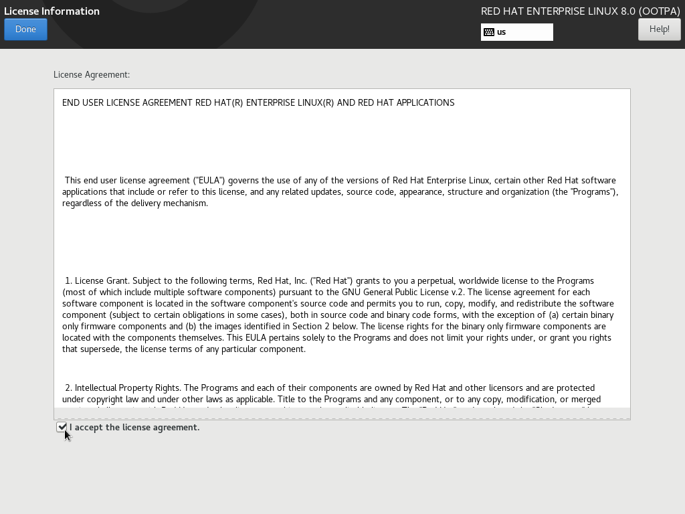
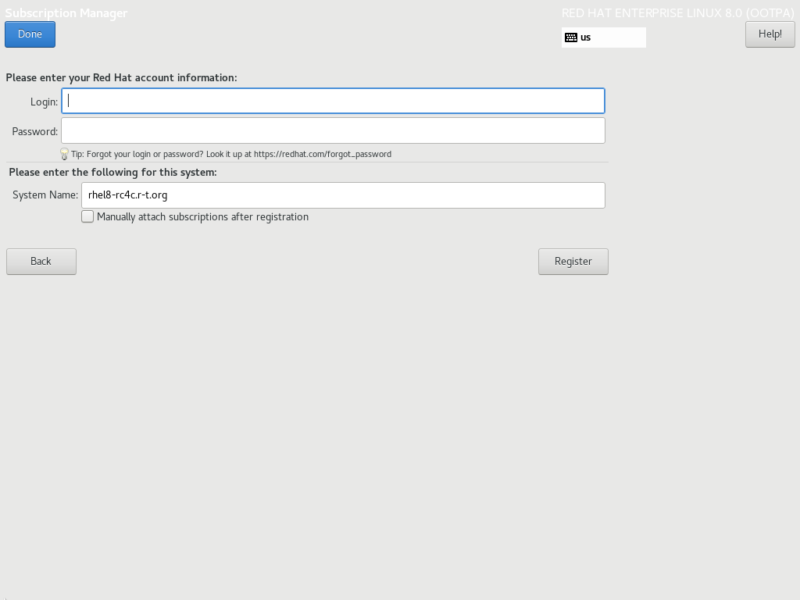
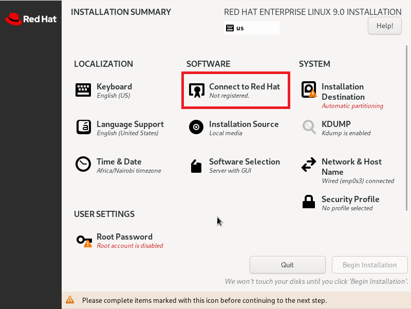

- Về cơ bản, RHEL là bản trả phí của CentOS, vì thế các cài đặt và cầu hình để đóng image là tương tự như nhau.

- RHEL 7 thì tương ứng với CentOS 7: [Đóng image CentOS 7](02_CentOS7.md)
- RHEL 8 và lớn hơn 8 (Mới nhất tại thời điểm viết bài này là 9.2): vẫn có thể sử dụng câu lệnh tương tự của CentOS 8: [Đóng image CentOS 8](03_CentOS8.md)
- Điểm khác biệt duy nhất là bạn có chịu chả phí cho RedHat hay không. Tuy nhiên RedHat cho đăng ký tài khoản và sử dụng thử nghiệm miễn phí. Đăng ký tài khoản tại: <https://developers.redhat.com/>. Các đăng ký có thể tham khảo rất nhiều bài viết khác trên internet
- Đã có tài khoản có thể tiến hành tải bản ISO tại đây: <https://developers.redhat.com/products/rhel/download#assembly-field-downloads-page-content-61451>. Thông thường thì ta tải xuống bản boot iso.

- Đối với RHEL 8, sau khi cài đặt hoàn tất và đăng nhập lần đầu tiên ta sẽ nhận được thông báo sau:

Click vào `I accept...`

Rồi sẽ nhận được như sau:

Đăng nhập đúng tài khoản và mật khẩu đã tạo ta sẽ được dùng thử trong 1 khoảng thời gian nhất định. Thường là 60 ngày.

- Đối với RHEL 9 trở lên, ngay trong lúc cài đặt đã được yêu cầu xác thực thông tin về người dùng và bản quyền như sau:

Tại đây hãy đăng nhập tài khoản RedHat đã đăng ký để có thể cài đặt và sử dụng RHEL 9.

Tài liệu tham khảo:

RHEL 8: <https://developers.redhat.com/rhel8/install-rhel8#>

RHEL 9: <https://www.tecmint.com/download-install-rhel-9-free/>

Date accessed: 31/07/2023
