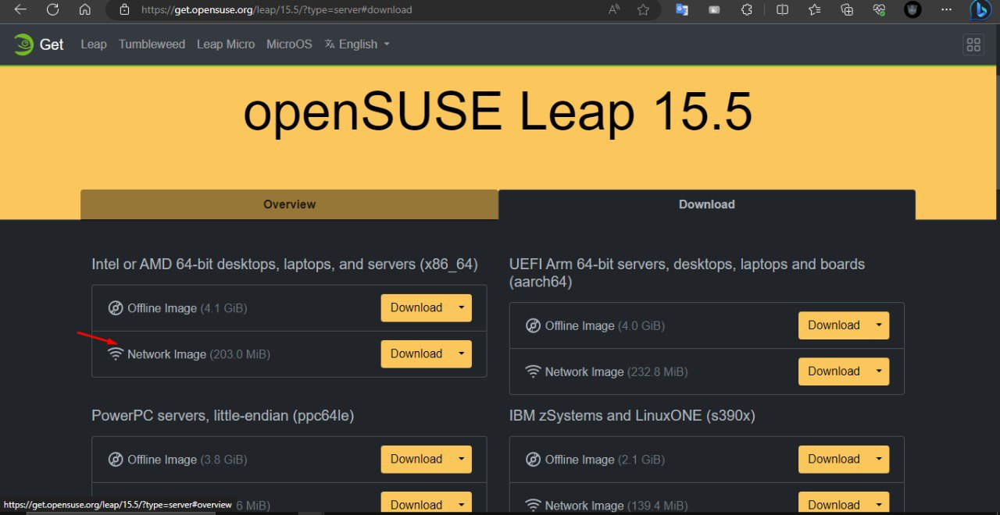

## Nội dung chính

- Việc hướng dẫn cài đặt sẽ không có trong bài này, chỉ có tài liệu tham khảo trong phần [Tài liệu tham khảo](#tài-liệu-tham-khảo)
- Việc cấu hình có thể bị sai lệch sau nhiều bản update của cả OS và cloud-init. Ưu tiên sử dụng các bản Stable.
- Trong bài sử dụng bản cài đặt [Network Image](https://download.opensuse.org/distribution/leap/15.5/iso/openSUSE-Leap-15.5-NET-x86_64-Media.iso)



## Cấu hình OS

Cài đặt các gói cần thiết

```sh
sudo zypper install xfsprogs python3-oauthlib python3-Jinja2 python3-PyYAML python3-distro python3-jsonpatch python3-jsonschema python3-PrettyTable python3-requests python3-configobj
sudo zypper install cloud-init growpart yast2-network yast2-services-manager acpid qemu-guest-agent
```

Tắt firewall

```sh
sudo systemctl enable sshd
sudo systemctl stop firewalld
sudo systemctl disable firewalld
```

Cấu hình grub để nhận card mạng và đẩy log console

```sh
sed -i 's/GRUB_CMDLINE_LINUX=""/GRUB_CMDLINE_LINUX="crashkernel=auto net.ifnames=0 biosdevname=0 console=tty0 console=ttyS0,115200n8"/g' /etc/default/grub
```

Cập nhật cấu hình grub

```sh
sudo exec grub2-mkconfig -o /boot/grub2/grub.cfg "$@"
```

Thay đổi file config của cloud-init thành file này:

```sh
 vi /etc/cloud/cloud.cfg
```

Nội dung file

```sh
# The top level settings are used as module
# and system configuration.

syslog_fix_perms: root:root
# A set of users which may be applied and/or used by various modules
# when a 'default' entry is found it will reference the 'default_user'
# from the distro configuration specified below
users:
   - default

# If this is set, 'root' will not be able to ssh in and they
# will get a message to login instead as the default $user
disable_root: false

# This will cause the set+update hostname module to not operate (if true)
preserve_hostname: false

# Example datasource config
# datasource:
#    Ec2:
#      metadata_urls: [ 'blah.com' ]
#      timeout: 5 # (defaults to 50 seconds)
#      max_wait: 10 # (defaults to 120 seconds)

# The modules that run in the 'init' stage
cloud_init_modules:
 - migrator
 - seed_random
 - bootcmd
 - write-files
 - growpart
 - resizefs
 - disk_setup
 - mounts
 - set_hostname
 - update_hostname
 - update_etc_hosts
 - ca-certs
 - rsyslog
 - users-groups
 - ssh

# The modules that run in the 'config' stage
cloud_config_modules:
 - ssh-import-id
 - locale
 - set-passwords
 - zypper-add-repo
 - ntp
 - timezone
 - disable-ec2-metadata
 - runcmd

# The modules that run in the 'final' stage
cloud_final_modules:
 - package-update-upgrade-install
 - puppet
 - chef
 - mcollective
 - salt-minion
 - rightscale_userdata
 - scripts-vendor
 - scripts-per-once
 - scripts-per-boot
 - scripts-per-instance
 - scripts-user
 - ssh-authkey-fingerprints
 - keys-to-console
 - phone-home
 - final-message
 - power-state-change

# System and/or distro specific settings
# (not accessible to handlers/transforms)
system_info:
   # This will affect which distro class gets used
   distro: opensuse
   # Default user name + that default users groups (if added/used)
   default_user:
     name: root
     lock_passwd: True
     gecos: opensuse Cloud User
     groups: [cdrom, users]
     sudo: ["ALL=(ALL) NOPASSWD:ALL"]
     shell: /bin/bash
   # Other config here will be given to the distro class and/or path classes
   paths:
      cloud_dir: /var/lib/cloud/
      templates_dir: /etc/cloud/templates/
   ssh_svcname: sshd
```

Bật khởi động cùng hệ thống

```sh
systemctl enable cloud-init-local.service cloud-init.service cloud-config.service cloud-final.service
```

Khởi chạy dịch vụ cloud-init

```sh
systemctl start cloud-init-local.service cloud-init.service cloud-config.service cloud-final.service
```

Kiểm tra trạng thái dịch vụ

```sh
systemctl status cloud-init-local.service cloud-init.service cloud-config.service cloud-final.service
```

tắt máy:

```sh
init 0
```

Chuyển sang host kvm, tiến hành dọn dẹp vm

```sh
virt-sysprep -d <tên-máy-ảo>
```

Tối ưu kích thước ổ cứng, có thể covert sang dạng cần thiết giữa qcow2 và img. Ở đây vẫn sẽ dùng qcow2.

```sh
virt-sparsify --compress /var/lib/libvirt/images/suseleap.qcow2 /root/suseleap-image.qcow2
```

Đẩy lên OpenStack để sử dụng, ở đây sử dụng Openstack-client để kết nối đến cụm OpenStack

```sh
openstack image create phucdh-openSUSE-Leap-v15-28072023 --disk-format qcow2 --container-format bare --file /root/suseleap-image.qcow2 --share --min-disk 10 --property hw_qemu_guest_agent=yes
```

## Tài liệu tham khảo

Cách cài đặt:

<https://openpower.ic.unicamp.br/post/opensuse-tutorial/>

<https://www.suse.com/c/opensuse-leap-step-by-step-guide-installing-on-your-virtualized-environment/>

<https://techviewleo.com/install-opensuse-leap-steps-with-screenshots/>

Cách cấu hình:

<https://www.ibm.com/docs/en/powervc/1.4.4?topic=linux-installing-configuring-cloud-init-sles>

<https://support.huaweicloud.com/intl/en-us/bestpractice-ims/ims_bp_0023.html>

file cấu hình:

<https://www.suse.com/c/opensuse-leap-step-by-step-guide-installing-on-your-virtualized-environment/>

Date accessed: 01-08-2023

